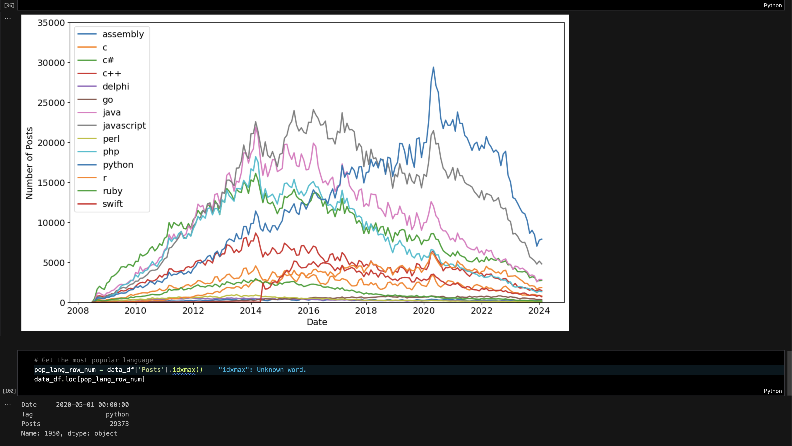

# 👨‍💻 Popularity Analysis of Different Programming Languages Over Time

A data analysis project that examines trends in the popularity of various programming languages over a specific time period. This project highlights key insights and visualizations to identify shifts in usage and interest.

---

## 📸 Screenshots

---

## ✨ Features

- Trend Analysis: Explores how the popularity of programming languages changes over time.
- Data Processing: Utilizes Pandas to clean and manipulate data for accurate analysis.
- Data Visualization: Creates visual trends and comparative charts using Matplotlib.

---

## ⚙️ Tech Stack

- Pandas: For data manipulation and preprocessing.
- Matplotlib: For creating insightful visualizations.
